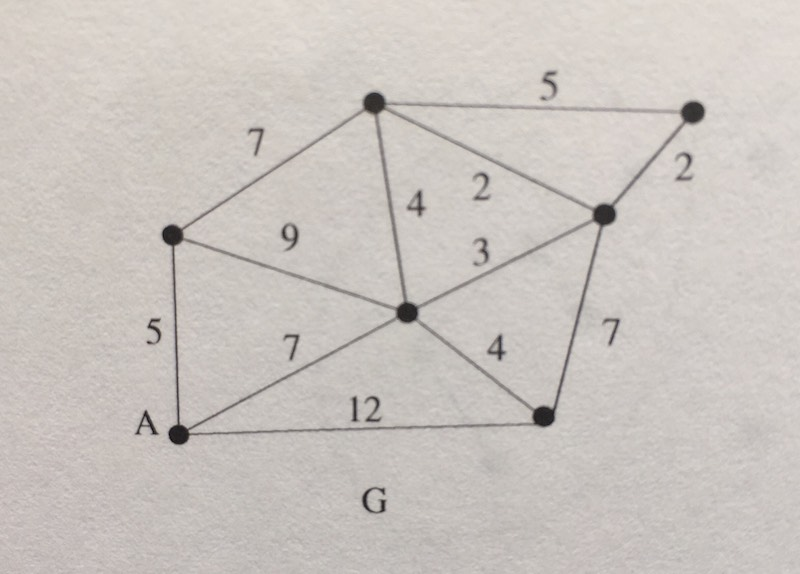

##### Dijkstra's Algorithm

Dijkstra's algorithm is used to find the shortest path between two nodes given a *weighted*
graph (directed or undirected).

In order to achieve this, most implementations of Dijkstra's algorithm make use of 3 data structures other
than the graph itself:
  - *visited*: a set of visited nodes to ensure that we don't visit the same node twice
  - *costs*: this is a dictionary where the keys represent the different nodes/vertices, and the
    values represent the current lowest cost to get to that node from our starting node.
  - *lowest cost priority queue*: this priority queue, which prioritizes the vertices with
    the lowest cost edges, is how our algorithm decides which vertex to pursue next.
  - *parents*: this adjacency-list (typically represented by a dictionary) acts as a book keeping
    measure that allows us to recreate the final path when we've reached our end node.
    The keys in this dictionary represent all other nodes (besides the start) in our
    graph that we can reach from the start, and the values are the immediate "parent" (or neighbor)
    that must precede this node in order to achieve the score represented in the `costs` dictionary.
    This `parents` DS can be avoided depending on what you want your implementation to return.

#### Steps
1. Since we're already given a starting node, we're going to use our starting node, give it
   a weight of 0, and specify it as parent-less
2. If we've already visited our current vertex, `v`, then continue on to the next vertex and
   repeat step 2 with the next vertex in the queue.
3. Iterate through all neighbors of our current vertex, and for each neighbor, `neighbor`:
   - Retrieve the current cheapest cost, `best-path`, to get to this neighbor from our `costs` dict,
     if none exist yet - then `best-path` is infinity (since we do not know how much this will be)
   - Compare `best-path` to `new-cost` (or, the current cost of `v` + the cost of `neighbor`)
   - if `new-cost` is less than `best-path`, then we know we have found a cheaper way to get to
     this particular neighbor and now must...
     - update our `costs` dictionary so that our neighbor vertex now points to `new-cost`
     - update our `parents` dictionary so that our neighbor now points to `v`
     - if our `visited` set does not already contain the vertex of `neighbor`, then we want
       to add a new edge to our queue where the vertex is our neighbor, the weight is `new-cost`,
       and the parent is `v`
4. Add `v` to our visited set
5. Repeat steps 2-4 until the queue is empty.
6. Now that we have exhausted all of our options, we want to actually construct the shortest
   path from `start` to `end`. All we have to do is get the value at `end` from our `parents`
   dictionary to get the best-path neighboring vertex of `end` (ie. the neighbor that precedes
   `end` in best path). Once we have our `best-path-neighboring-vertex`, we then get the best
   path neighboring vertex of `best-path-neighboring-vertex` from `parents`, and repeat these steps
   until our `best-path-neighboring-vertex` is equal to `start`!

Dijkstra's algorithm is surprisingly similar to Prim's algorithm, and isn't much more than a
Breadth First Search with clever book-keeping in order to reconstruct the best path. Dijkstra's
algorithm does not work with negative-weight edges.

Here is the graph that is referenced from the tests:

