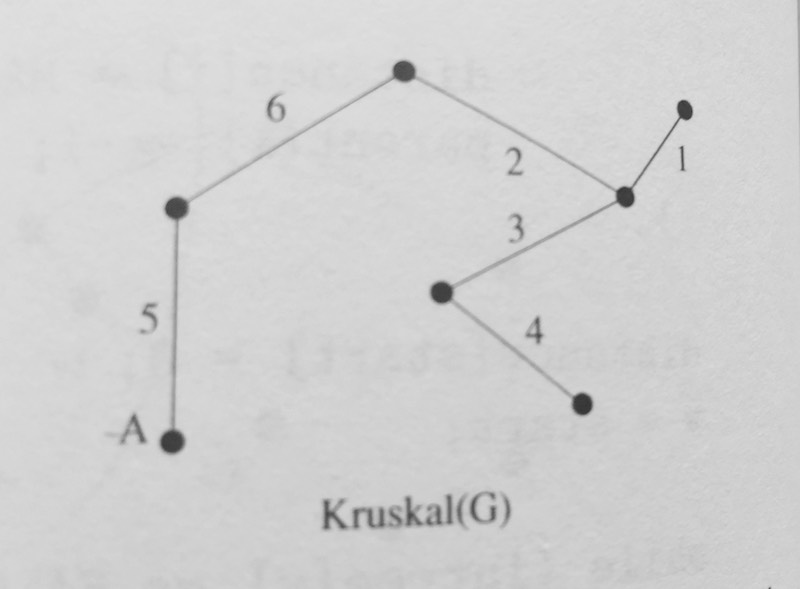

### Kruskal's Algorithm

Like Prim's, Kruskal's algorithm also constructs a minimum spanning tree given a graph. However,
Kruskal's algorithm makes use of a unique data structure called union-find, making it the preferred
algorithm for minimum spanning trees over Prim's.

#### Union-Find

Union-find supports two primary operations that we need to take advantage of:

  - Find(i): Find the root of the tree containing element `i` by walking up the parent pointers
    until there is no where to go. Return the label of the root
  - Union(i, j): Link the root of one of the tree to the root of the tree containing the other,
    so `find(i)` now equals `find(j)`

There's also a third operation that we use in Kruskal's:
  - SameSet?(i, j): Do `i` and `j` have the same root parent? (ie. does `find(i)` equal `find(j)`?)

In order to perform these operation efficiently, the union-find struct will usually contain the
following properties:
  - `Nodes` - this would be a dictionary where the keys are the labels of the nodes, and the
    values themselves represent the index of that node (ie. label) in the following properties
  - `Parents` - this is an array where the positions are indicative of the nodes from the
    `nodes` dictionary, and the values are the labels of that node's root parent
  - `Tree Size` - this is another array where the indices represent the nodes and the values
     are the number of nodes in the same tree. This property is used during the union function,
     which merges the node with the smaller tree into the node with the larger tree.

Although it looks simple, the union-find data structure is a useful way to keep track of the
state of our minimum spanning tree as we build it. At each step of the way, we must make sure that
the next edge we use doesn't introduce a path that we haven't already added to our sub tree.

In Prim's algorithm, we were only building on the neighbors of the vertices that we had already
marked as visited, but union-find allows us to introduce any new edge to our tree and be able
to decide whether we still need any other given edge without the need for a `visited` variable

#### Steps

Kruskal's algorithm executes as follows:

1. Sort all edges by weight (ascending)
2. Grab top edge and check whether they belong to the same set in our union-find
  - If the 2 vertices belong to the same set then we can be sure that we already
    have a path between these two particular vertices and can skip over this
    edge and re-do step 2
3. Add this edge to our min spanning tree.
4. Union these two vertices in our minimum spanning tree
5. Repeat steps 2 - 5 with the next edge in the sorted list until we have gone through all the edges

Here is the example graph that is referenced the tests:

And here is Kruskal's minimum spanning tree:

