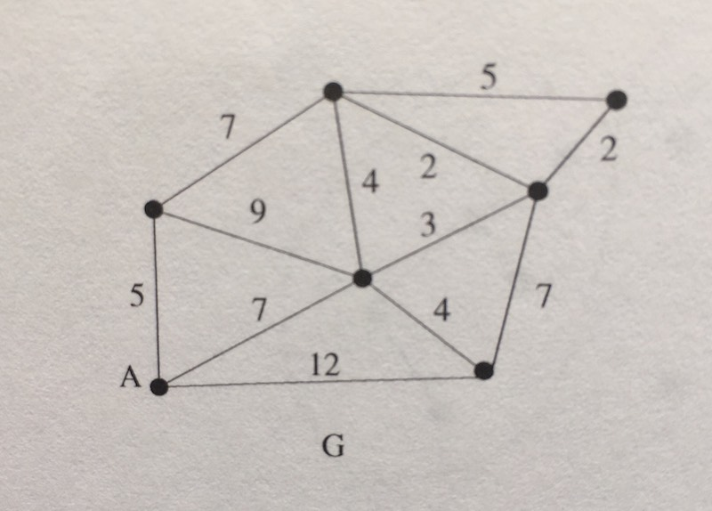
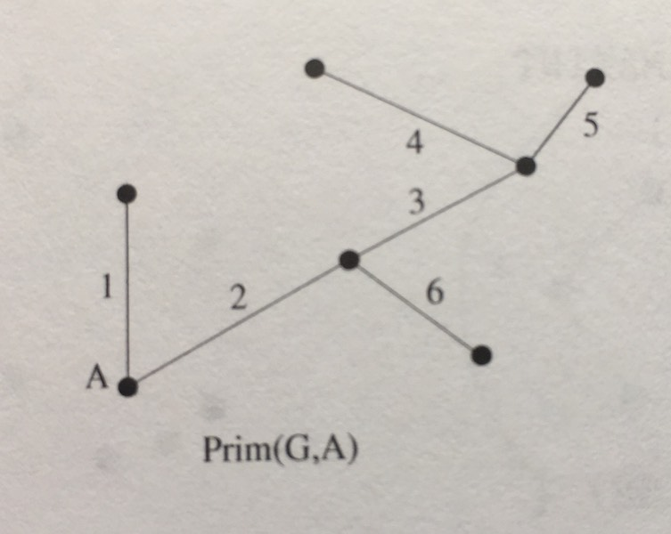

### Prim's Algorithm

Prim's Algorithm find the minimum spanning tree of a graph by utilizing a data
structure called a priority queue.

#### Priority Queue

Without getting into too much detail, a priority queue is just like a queue in
the sense that it is a FIFO data structure. However the difference is that a priority
queue will prioritize certain elements _over_ other elements, regardless of when the
elements entered the queue. The mechanism for prioritization is ascribed to the priority
queue by the client.

We will really only use 2 operations from the queue structure:
  - enqueue: add this item to the queue
  - dequeue: remove (and return) the next item from the queue

#### Steps

Prim's algorithm is very similar to Breadth First Search in execution. In Prim's we also want
to keep track of the nodes that we have already visited. Unlike BFS, in this algorithm we're
going to use a priority queue instead of a normal queue - with the priority being the lowest
weight edges.

To start, we simply pick a random node:

1. Make sure this node, `i`, has not been visited before
  - if we have visited this node before, then simply repeat step 1 with the next node
    from our queue
2. Add all the neighbors of `i` that we have not yet visited to our priority queue
  - When we add the neighbors of `i`, we must do some book keeping so that when we
    do get to this neighbor node, we know that it's parent is `i`
3. If we came from another vertex (ie. we're not on the first node) add edge with
   `i` and it's parent node to the min spanning tree.
  - Since we're constructing a min spanning tree, we're really only concerned with
    edges when constructing our result. That's why it doesn't really matter which _vertex_
    we start out with, because we only begin construction once our first edge is
    complete.
4. Mark our current node as visited.
5. Repeat steps 1 - 4 with the next node in the priority queue until it is empty.

Here is the graph that is referenced from the tests:

And here is what Prim's minimum spanning tree looks like for the graph:

